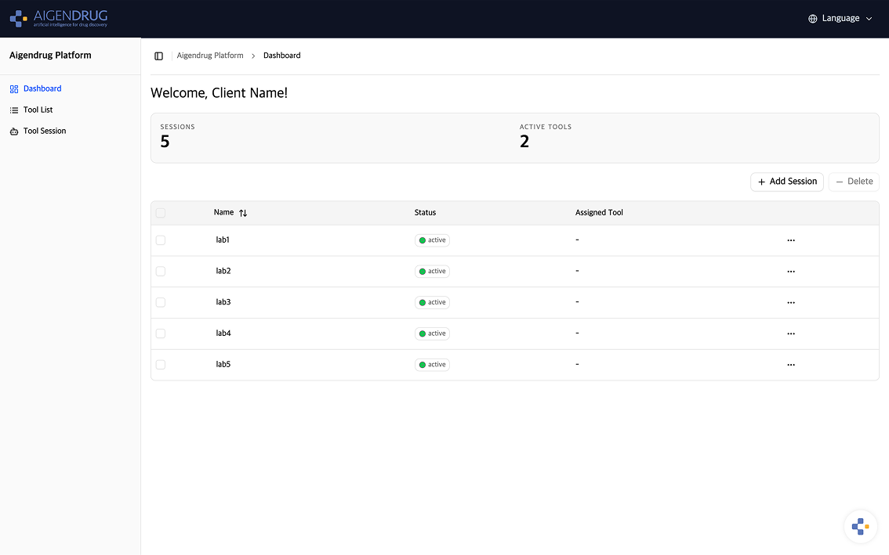
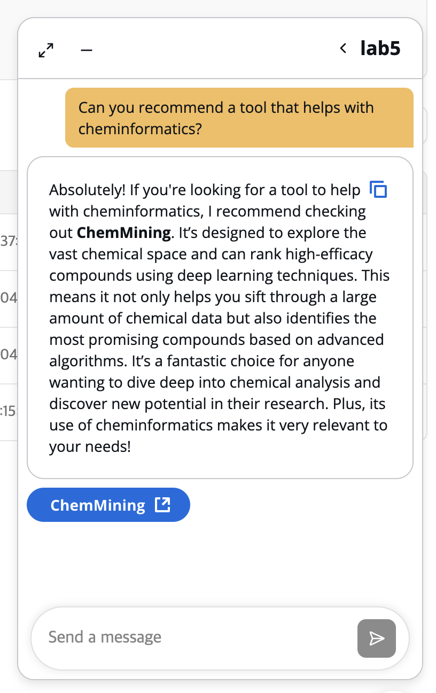
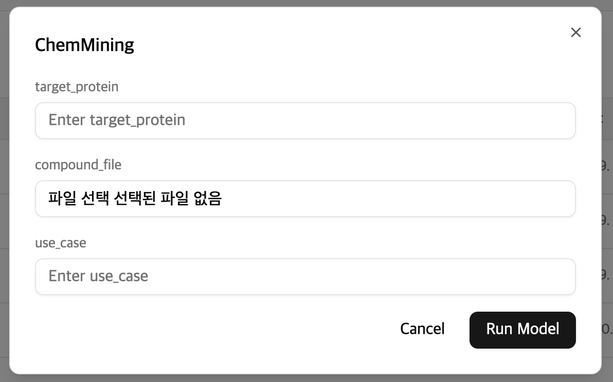
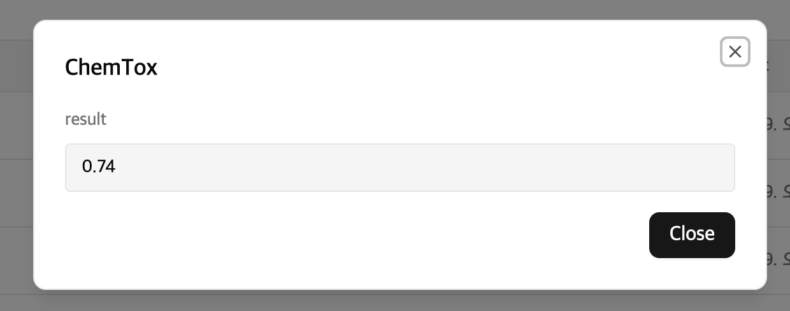
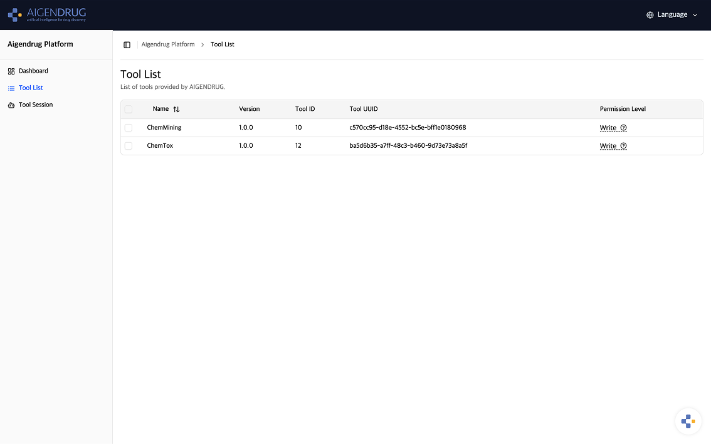
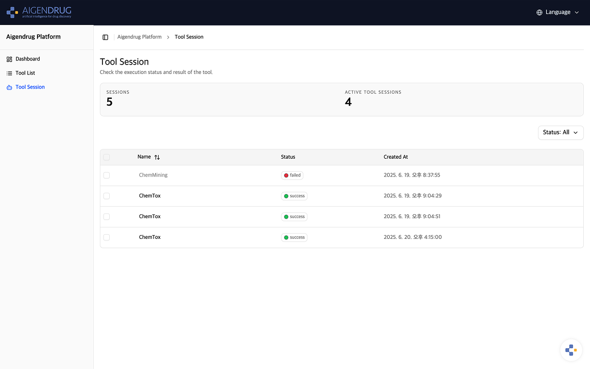

# ATP-Client

AIGENDRUG Tool Platform Client Application

## Authors

Course Information: 2025 Seoul Nat'l University, Creative Integrated Design 2

Group A:

- Yang Gil Mo - [AtlasYang](https://github.com/AtlasYang)
- Khinwaiyan - [khinwaiyan](https://github.com/khinwaiyan)
- Kim Da In - [dida0423](https://github.com/dida0423)

---

## Introduction

**ATP-Client** is the comprehensive user-facing application of the **AIGENDRUG Tool Platform**, providing an intuitive interface for tool discovery, interactive chat-based assistance, and smooth tool execution. This client application connects to ATP-Central to deliver AI-powered tool selection and execution capabilities through a modern, responsive web interface.

The platform enables users to interact with computational tools using natural language, automatically matching user intents with appropriate tools and providing real-time execution.

---

## Table of Contents

1. [Key Features](#key-features)
2. [Architecture Overview](#architecture-overview)
3. [Technology Stack](#technology-stack)
4. [Getting Started](#getting-started)
5. [Navigating the Application](#navigating-the-application)
6. [Troubleshooting](#troubleshooting)
7. [Support](#support)

---

## Key Features

- **Intelligent Chat Interface** – AI-powered tool selection and execution via natural language
- **Real-time WebSocket Communication** – Live updates for chat and tool outputs
- **Multi-Session Management** – Persistent conversation history across sessions
- **Dynamic Tool Registration** – Register and configure tools interactively
- **Responsive Design** – Mobile-first React + Tailwind UI
- **Multi-language Support** – English and Korean support via `react-i18next`
- **Tool Execution Monitoring** – Real-time tool execution tracking and visualization

---

## Architecture Overview

### Server (Go/Gin)

- Built with the Gin framework
- RESTful API + WebSocket communication
- PostgreSQL-based persistence
- Integration with ATP-Central using secure API keys

**Core Services:**

- Chat Service
- Tool Service
- Session Management
- ATP-Central Communication

**Key Capabilities:**

- RESTful API endpoints for all client operations
- WebSocket-based real-time chat and tool execution updates
- Integration with ATP-Central via secure API key authentication
- Session and message persistence using PostgreSQL

### Web Client (React/TypeScript)

- Responsive SPA built with Vite + React
- Component-driven design using Cloudscape and Tailwind
- Chat, dashboard, and modal-driven tool execution flow

---

## Technology Stack

- **Backend Framework**: [Go Gin](https://gin-gonic.com/) - High-performance HTTP web framework
- **Frontend Framework**: [React](https://reactjs.org/) with [TypeScript](https://www.typescriptlang.org/) - Modern web application development
- **Database**: [PostgreSQL](https://www.postgresql.org/) - Advanced open-source relational database
- **UI Library**: [Cloudscape Design System](https://cloudscape.design/) - Open source UI Library made by AWS
- **Real-time Communication**: [WebSocket](https://developer.mozilla.org/en-US/docs/Web/API/WebSockets_API) - Bidirectional communication
- **Styling**: [Tailwind CSS](https://tailwindcss.com/) - Utility-first CSS framework
- **Build Tool**: [Vite](https://vitejs.dev/) - Fast build tool and development server
- **Internationalization**: [react-i18next](https://react.i18next.com/) - Multi-language support
- **Containerization**: [Docker](https://www.docker.com/) - Application containerization

---

## Getting Started

### Prerequisites

For self-hosted deployment:

- Docker and Docker Compose
- Node.js 18+ with npm/yarn (for development)
- Go 1.22+ (for development)
- Linux environment (Ubuntu 20.04+ recommended)

### Configuration

Before deployment, you'll need to configure environment variables:

#### Required Environment Variables

**Server Configuration:**

- **ATP_ROUTER_HOST**: ATP-Central service endpoint
- **ATP_ROUTER_API_KEY**: API key for ATP-Central authentication
- **POSTGRES_PASSWORD**: Secure password for PostgreSQL database
- **DB_HOST**, **DB_PORT**: Database connection settings
- **PORT**: Server port (default: 8080)
- **RUN_MODE**: Environment mode (release for production, debug for development)

**Client Configuration:**

- **VITE_API_BASE_URL**: Backend API endpoint
- **VITE_WS_URL**: WebSocket connection URL

All configuration options are documented in the `.env.example` file with placeholder values and descriptions.

### Installation

#### Self-Hosted Deployment

The self-hosted setup uses Docker Compose for simplified deployment:

1. **Environment Configuration**

   ```bash
   # Copy environment template and configure your settings
   cp .env.example .env

   # Edit the .env file with your actual values:
   # - Set ATP_ROUTER_HOST to your ATP-Central endpoint
   # - Add your ATP_ROUTER_API_KEY
   # - Set POSTGRES_PASSWORD to a secure password
   # - Configure other service settings as needed
   vim .env  # or use your preferred editor
   ```

2. **Deploy All Services**
   ```bash
   # Start all services with Docker Compose
   docker compose up -d
   ```

#### Production Cloud Deployment

For production cloud deployment:

1. **Database**: Deploy PostgreSQL using managed database services
2. **Server**: Deploy to container services with auto-scaling
3. **Web Client**: Deploy to CDN or static hosting services
4. **Load Balancing**: Configure load balancer for high availability

---

## Navigating the Application

**Dashboard**



- This screen allows you to manage chat sessions and access to it.
- Press FAB at bottom right corner to open chat panel.

**Chat panel**



- Create new chat session and write any prompt to get tool recommendation.


**Tool Request & Response Modal**




- Tool request and response modal is automatically generated based on tool interface.
- Results shown as text, tables, images, or downloadable links.

**Tool List**



- All tools that you can access based on permission.

**Tool Session**



- Press tool name to read the response of successful tool request.

---

## Troubleshooting

### Common Issues

- **Connection Issues**: Verify ATP-Central service is running and accessible
- **Authentication Errors**: Check API key configuration in environment variables
- **Database Problems**: Ensure PostgreSQL is properly configured and running
- **WebSocket Failures**: Confirm CORS settings and network connectivity

## Support

📧 Contact: [khinwaiyan@snu.ac.kr](mailto:khinwaiyan@snu.ac.kr)  
For bug reports or feature requests, open an issue on the GitHub repository.